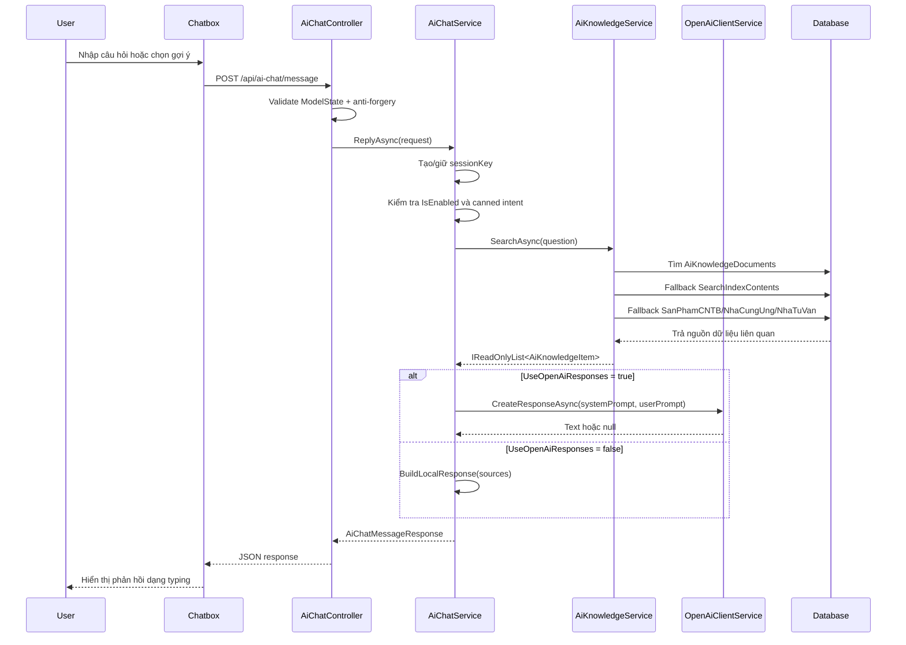
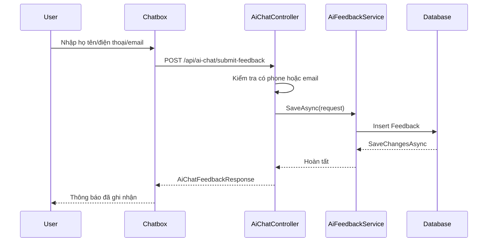

# AI Support / Chatbox - Tài liệu thiết kế kỹ thuật

## 1. Mục tiêu và phạm vi

AI Support / Chatbox là hộp chat hỗ trợ người dùng trên website Sàn giao dịch Công nghệ Thành phố Cần Thơ. Tính năng hỗ trợ khách truy cập tìm nhanh thông tin về công nghệ, sản phẩm CNTB, nhà cung ứng, chuyên gia tư vấn, nội dung đã công bố trên website và gửi yêu cầu tư vấn khi cần liên hệ trực tiếp.

Phạm vi hiện tại:

- Có chatbox nổi trên layout chung.
- Có API gửi/nhận tin nhắn và gửi feedback/lead.
- Có service tìm dữ liệu nội bộ từ knowledge base và các bảng nghiệp vụ.
- Có tích hợp OpenAI Responses API, chỉ gọi khi bật bằng cấu hình.
- Có script tạo bảng AI Support và script đồng bộ dữ liệu vào `AiKnowledgeDocuments`.
- Có lưu lead vào bảng `Feedback`.
- Chưa thấy code hiện tại lưu transcript hội thoại vào `AiChatSessions`/`AiChatMessages`.
- Chưa thấy rate limit riêng cho endpoint AI chat.
- Chưa thấy Chatbox dùng embedding/vector search trực tiếp trong luồng hiện tại.

## 2. Danh sách file liên quan

### Frontend/UI

- `TechExchangeApp/Views/Shared/_Layout.cshtml`
  - Nạp CSS `~/css/ai-chatbox.css`.
  - Tạo meta anti-forgery token `__RequestVerificationToken`.
  - Render `@await Component.InvokeAsync("AiChatBox")`.
  - Nạp JS `~/js/ai-chatbox.js`.
- `TechExchangeApp/ViewComponents/AiChatBoxViewComponent.cs`
  - Đọc `AiChatOptions`.
  - Trả về view component khi `AiChat:IsEnabled` bật.
- `TechExchangeApp/Views/Shared/Components/AiChatBox/Default.cshtml`
  - Markup chatbox: launcher, panel, header, message list, suggestions, feedback form, composer form.
- `TechExchangeApp/wwwroot/css/ai-chatbox.css`
  - Style chatbox, message, suggestion, feedback form, responsive.
- `TechExchangeApp/wwwroot/js/ai-chatbox.js`
  - Điều khiển mở/đóng chatbox.
  - Gọi API.
  - Lưu `sessionKey` vào `localStorage`.
  - Gửi anti-forgery token qua header `RequestVerificationToken`.
  - Hiển thị bot response theo hiệu ứng typing/typewriter.

### Backend/API/service

- `TechExchangeApp/Controllers/Api/AiChatController.cs`
  - Controller API chính cho chatbox.
- `TechExchangeApp/Services/AiChatService.cs`
  - Điều phối xử lý câu hỏi và câu trả lời.
- `TechExchangeApp/Services/AiKnowledgeService.cs`
  - Tìm dữ liệu nội bộ.
- `TechExchangeApp/Services/AiFeedbackService.cs`
  - Lưu lead/yêu cầu tư vấn vào `Feedback`.
- `TechExchangeApp/Services/OpenAiClientService.cs`
  - Gọi OpenAI Responses API.

### Model/config/entity

- `TechExchangeApp/Models/AiChatDtos.cs`
  - DTO request/response và item nguồn dữ liệu.
- `TechExchangeApp/Configuration/AiChatOptions.cs`
  - Cấu hình section `AiChat`.
- `TechExchangeApp/Entities/AiKnowledgeDocument.cs`
  - Entity map bảng `AiKnowledgeDocuments`.
- `TechExchangeApp/Entities/Feedback.cs`
  - Entity lưu feedback/lead.
- `TechExchangeApp/Data/AppDbContext.cs`
  - DbSet liên quan.
- `TechExchangeApp/Program.cs`
  - Dependency injection và cấu hình options.
- `TechExchangeApp/appsettings.json`
  - Chứa tên key cấu hình liên quan. Không ghi giá trị secret trong tài liệu này.

### Database/script

- `TechExchangeApp/Create_AiChatSupport_Tables.sql`
  - Tạo các bảng hỗ trợ AI chat và knowledge base.
- `TechExchangeApp/Sync_AiKnowledgeDocuments.sql`
  - Đồng bộ dữ liệu website vào `AiKnowledgeDocuments`.

### Thành phần AI/search liên quan trong dự án

- `TechExchangeApp/Infrastructure/AI/OpenAIEmbeddingService.cs`
- `TechExchangeApp/Domain/Entities/SanPhamEmbedding.cs`
- `TechExchangeApp/Domain/Entities/AISearchLog.cs`

Lưu ý: các file embedding/log trên thuộc phần AI/search rộng hơn của dự án; luồng Chatbox hiện tại chưa gọi embedding/vector search trực tiếp.

## 3. Sơ đồ luồng xử lý

### Luồng hỏi đáp chính



### Luồng gửi thông tin liên hệ



## 4. API request/response

### GET `/api/ai-chat/suggestions`

Mục đích: lấy danh sách câu hỏi/gợi ý nhanh hiển thị trên chatbox.

Request:

- Không có body.

Response thành công:

```json
[
  "Tim cong nghe",
  "Tim san pham CNTB",
  "Dich vu tu van",
  "Gui yeu cau ho tro",
  "Lien he trung tam"
]
```

Nguồn xử lý:

- `AiChatController.Suggestions()`
- `IAiChatService.GetSuggestions()`

### POST `/api/ai-chat/message`

Mục đích: nhận câu hỏi của người dùng và trả câu trả lời.

Yêu cầu bảo vệ:

- Có `[ValidateAntiForgeryToken]`.
- Frontend gửi header `RequestVerificationToken`.
- Request body map vào `AiChatMessageRequest`.

Request body:

```json
{
  "message": "Tim may say",
  "sessionKey": "optional-session-key"
}
```

Field:

- `message`: bắt buộc, tối đa 2000 ký tự.
- `sessionKey`: tùy chọn, tối đa 100 ký tự. Nếu trống, backend tạo mới.

Response thành công:

```json
{
  "success": true,
  "message": "Noi dung tra loi cua AI Support",
  "sessionKey": "generated-or-existing-session-key",
  "sources": [
    {
      "sourceType": "San pham CNTB",
      "title": "Tieu de nguon du lieu",
      "url": "/duong-dan-nguon",
      "summary": "Tom tat noi dung lien quan"
    }
  ],
  "needsContactInfo": false
}
```

Response lỗi xử lý:

```json
{
  "success": false,
  "message": "He thong AI chat dang gap loi khi xu ly yeu cau. Anh/chi vui long de lai thong tin de trung tam lien he ho tro.",
  "sessionKey": "generated-or-existing-session-key",
  "sources": [],
  "needsContactInfo": true
}
```

Nguồn xử lý:

- `AiChatController.Message()`
- `IAiChatService.ReplyAsync()`

### POST `/api/ai-chat/submit-feedback`

Mục đích: lưu thông tin liên hệ/yêu cầu tư vấn khi người dùng cần hỗ trợ thêm.

Yêu cầu bảo vệ:

- Có `[ValidateAntiForgeryToken]`.
- Frontend gửi header `RequestVerificationToken`.
- Backend yêu cầu có ít nhất `phone` hoặc `email`.

Request body:

```json
{
  "fullName": "Nguyen Van A",
  "phone": "0900000000",
  "email": "user@example.com",
  "message": "Noi dung can tu van",
  "sessionKey": "optional-session-key"
}
```

Field:

- `fullName`: tùy chọn, tối đa 255 ký tự.
- `phone`: tùy chọn, tối đa 50 ký tự.
- `email`: tùy chọn, tối đa 100 ký tự.
- `message`: tùy chọn, tối đa 2000 ký tự.
- `sessionKey`: tùy chọn, tối đa 100 ký tự.

Response thành công:

```json
{
  "success": true,
  "message": "Thong tin cua anh/chi da duoc ghi nhan. Trung tam se lien he ho tro trong thoi gian som nhat."
}
```

Response thiếu phone/email:

```json
{
  "success": false,
  "message": "Vui long nhap so dien thoai hoac email de trung tam lien he."
}
```

Nguồn xử lý:

- `AiChatController.SubmitFeedback()`
- `IAiFeedbackService.SaveAsync()`

## 5. Service/class tham gia xử lý

### `AiChatBoxViewComponent`

Vai trò:

- Nhận `IOptions<AiChatOptions>`.
- Truyền options sang view component.
- View chỉ render nếu `Model.IsEnabled`.

### `AiChatController`

Vai trò:

- Định tuyến `api/ai-chat`.
- Cung cấp 3 endpoint thực tế: `suggestions`, `message`, `submit-feedback`.
- Validate request.
- Bắt exception và trả response thân thiện cho frontend.

### `AiChatService`

Vai trò:

- Tạo hoặc giữ `sessionKey`.
- Kiểm tra cấu hình `IsEnabled`.
- Xử lý canned response cho chào hỏi, cảm ơn, liên hệ.
- Gọi `AiKnowledgeService.SearchAsync()`.
- Khi `UseOpenAiResponses = true`, build user prompt và gọi `OpenAiClientService`.
- Khi không có AI response, tự build local response từ nguồn dữ liệu tìm được.
- Quyết định có cần mở form liên hệ qua `NeedsContactInfo`.

Logic đáng chú ý:

- Nếu không tìm thấy source, trả câu mời để lại thông tin liên hệ.
- Nếu câu hỏi chứa ý định tư vấn/liên hệ/báo giá/hỗ trợ, `NeedsContactInfo` có thể là `true`.
- Câu trả lời local lấy tối đa 4 source đầu tiên để hiển thị.

### `AiKnowledgeService`

Vai trò:

- Chuẩn hóa keyword.
- Bỏ dấu tiếng Việt để tăng khả năng match.
- Dùng collation `Vietnamese_CI_AI`.
- Tìm dữ liệu theo thứ tự:
  - `AiKnowledgeDocuments`
  - `SearchIndexContents`
  - `SanPhamCNTB`
  - `NhaCungUng`
  - `NhaTuVan`
- Làm sạch HTML bằng regex và HTML decode.
- Giới hạn title/summary trước khi đưa vào response/context.

Giới hạn số kết quả:

- Dùng `AiChat:MaxContextItems`.
- Code clamp trong khoảng 1 đến 10.

### `AiFeedbackService`

Vai trò:

- Tạo entity `Feedback`.
- Lưu `FullName`, `Email`, `Phone`, `Title`, `Content`, `Created`, `StatusId`, `SiteId`, `Domain`, `Creator`.
- Gán `Creator = "AIChat"`.
- Ghi nguồn `AI Support Chat Box` và `SessionKey` vào content nếu có.

### `OpenAiClientService`

Vai trò:

- Đọc `OpenAI:ApiKey`.
- Nếu thiếu API key, trả `null`.
- Gửi request đến OpenAI Responses API `/v1/responses`.
- Dùng model từ `AiChat:ModelName`.
- Dùng timeout từ `AiChat:TimeoutSeconds`, tối thiểu 5 giây.
- Parse `output_text`, fallback parse `output[].content[].text`.
- Log lỗi HTTP/exception và trả `null`.

## 6. Database/entity/table liên quan

### Entity/DbSet dùng trực tiếp

- `AiKnowledgeDocument`
  - Table: `AiKnowledgeDocuments`
  - DbSet: `AppDbContext.AiKnowledgeDocuments`
  - Dùng trong `AiKnowledgeService`.
- `Feedback`
  - Table: `Feedback`
  - DbSet: `AppDbContext.Feedbacks`
  - Dùng trong `AiFeedbackService`.

### Nguồn tìm kiếm dùng bởi `AiKnowledgeService`

- `SearchIndexContents`
- `SanPhamCNTB`
- `NhaCungUng`
- `NhaTuVan`

### Bảng do script AI Support tạo

File: `TechExchangeApp/Create_AiChatSupport_Tables.sql`

- `AiChatSettings`
  - Lưu cấu hình chat nếu mở rộng quản trị bằng DB.
  - Code hiện tại chưa đọc trực tiếp bảng này.
- `AiChatSessions`
  - Dự kiến lưu session chat.
  - Code hiện tại chưa insert/update bảng này.
- `AiChatMessages`
  - Dự kiến lưu message transcript.
  - Code hiện tại chưa insert/update bảng này.
- `AiKnowledgeDocuments`
  - Knowledge base chính cho chatbox.
  - Có entity và DbSet.
- `AiKnowledgeSyncJobs`
  - Ghi trạng thái job đồng bộ.
  - Dùng trong SQL sync script, chưa có entity C# riêng.

### Trường chính của `AiKnowledgeDocuments`

- `Id`
- `SourceType`
- `SourceId`
- `SourceSlug`
- `Title`
- `Url`
- `ContentText`
- `ContentHash`
- `IsActive`
- `DatasetVersion`
- `LastSyncedAt`

### Thành phần AI/search rộng hơn

- `SanPhamEmbedding` / `SanPhamEmbeddings`
- `AISearchLog` / `AISearchLogs`
- `OpenAIEmbeddingService`

Lưu ý: các thành phần này có trong dự án nhưng không nằm trong luồng xử lý Chatbox hiện tại.

## 7. Cấu hình hệ thống

### Section `AiChat`

- `AiChat:IsEnabled`
  - Bật/tắt chatbox và xử lý chat.
- `AiChat:BotName`
  - Tên bot hiển thị trên UI.
- `AiChat:WelcomeMessage`
  - Lời chào đầu tiên trong khung chat.
- `AiChat:SystemPrompt`
  - Prompt hệ thống dùng khi gọi AI provider.
- `AiChat:ModelName`
  - Model dùng cho OpenAI Responses API.
- `AiChat:UseOpenAiResponses`
  - Bật/tắt gọi OpenAI cho câu trả lời.
- `AiChat:MaxContextItems`
  - Số nguồn dữ liệu nội bộ tối đa đưa vào tìm kiếm/context.
- `AiChat:MaxMessagesPerSession`
  - Key cấu hình hiện có, nhưng chưa thấy code hiện tại dùng để chặn số message.
- `AiChat:TimeoutSeconds`
  - Timeout khi gọi AI provider.

### Section `OpenAI`

- `OpenAI:ApiKey`
  - API key dùng cho OpenAI.
  - Không ghi giá trị thật trong tài liệu/source commit.
- `OpenAI:EmbeddingModel`
  - Model embedding cho phần embedding/search rộng hơn.
- `OpenAI:ChatModel`
  - Model chat mặc định trong cấu hình OpenAI.

### Dependency injection

Trong `TechExchangeApp/Program.cs`:

- `Configure<AiChatOptions>(...)`
- `AddScoped<IAiChatService, AiChatService>()`
- `AddScoped<IAiKnowledgeService, AiKnowledgeService>()`
- `AddScoped<IAiFeedbackService, AiFeedbackService>()`
- `AddHttpClient<IOpenAiClientService, OpenAiClientService>()`

## 8. Prompt/knowledge/context

### System prompt

System prompt được cấu hình qua `AiChat:SystemPrompt`. Nội dung hiện tại định hướng bot:

- Là trợ lý AI của Sàn giao dịch Công nghệ thành phố Cần Thơ.
- Chỉ trả lời dựa trên dữ liệu website được cung cấp.
- Nếu chưa có dữ liệu phù hợp, đề nghị người dùng để lại thông tin tư vấn.

Không có secret trong system prompt.

### User prompt khi gọi OpenAI

`AiChatService.BuildUserPrompt()` tạo prompt gồm:

- Câu hỏi của người dùng.
- Danh sách dữ liệu website liên quan.
- Mỗi source gồm `SourceType`, `Title`, `Url`, `Summary`.
- Hướng dẫn trả lời ngắn gọn bằng tiếng Việt.
- Yêu cầu ưu tiên đưa link nguồn nếu có.
- Yêu cầu không tự bịa thông tin khi dữ liệu chưa đủ.

### Knowledge/context

Nguồn context lấy từ `AiKnowledgeService.SearchAsync()`:

- Ưu tiên `AiKnowledgeDocuments`.
- Fallback `SearchIndexContents`.
- Fallback các bảng nghiệp vụ `SanPhamCNTB`, `NhaCungUng`, `NhaTuVan`.

Chuẩn hóa dữ liệu:

- Cắt keyword dài tối đa 120 ký tự.
- Bỏ các prefix tìm kiếm như `tim`, `toi can`, `can tim`, `cho toi`, `hay tim`, `search`.
- Bỏ dấu tiếng Việt.
- Dùng collation `Vietnamese_CI_AI`.
- Làm sạch HTML và decode entity.
- Giới hạn title khoảng 160 ký tự, summary khoảng 700 ký tự.

### Local response

Khi không gọi OpenAI hoặc OpenAI không trả text:

- Nếu không có source: trả lời chưa tìm thấy dữ liệu phù hợp và mời để lại thông tin liên hệ.
- Nếu có source: trả danh sách một số thông tin liên quan kèm URL nếu có.

## 9. Đồng bộ dữ liệu và vận hành

### Tạo bảng

Script:

- `TechExchangeApp/Create_AiChatSupport_Tables.sql`

Mục đích:

- Tạo bảng cấu hình/session/message/knowledge/sync job nếu chưa tồn tại.
- Không thay thế các bảng nghiệp vụ hiện có.

Khuyến nghị vận hành:

- Chạy script bằng công cụ quản trị DB nội bộ.
- Không ghi command có credential thật vào tài liệu.
- Sao lưu database trước khi thay đổi schema ở môi trường thật.

### Đồng bộ knowledge base

Script:

- `TechExchangeApp/Sync_AiKnowledgeDocuments.sql`

Nguồn dữ liệu:

- `Contents`
- `SanPhamCNTB`
- `NhaCungUng`
- `NhaTuVan`

Cơ chế:

- Tạo `DatasetVersion`.
- Ghi job vào `AiKnowledgeSyncJobs`.
- Đưa dữ liệu nguồn vào bảng tạm.
- `MERGE` vào `AiKnowledgeDocuments` theo `SourceType` và `SourceId`.
- Cập nhật trạng thái job `Completed` hoặc `Failed`.
- Không đưa dữ liệu feedback/lead vào knowledge base.

### Reset data

Mục tiêu reset thường gặp:

- Làm mới knowledge base khi dữ liệu website thay đổi nhiều.
- Xóa dữ liệu đồng bộ lỗi.
- Chạy lại sync từ nguồn chính.

Nguyên tắc an toàn:

- Không reset bảng `Feedback` nếu không có yêu cầu nghiệp vụ rõ ràng.
- Không xóa bảng nghiệp vụ nguồn như `Contents`, `SanPhamCNTB`, `NhaCungUng`, `NhaTuVan`.
- Sao lưu DB hoặc tạo snapshot trước khi thao tác dữ liệu thật.
- Ưu tiên chạy lại `Sync_AiKnowledgeDocuments.sql` để cập nhật bằng `MERGE`.
- Nếu cần reset cứng `AiKnowledgeDocuments`, thực hiện bằng script vận hành riêng đã được review và không chứa credential thật.

Checklist vận hành sau sync:

- Kiểm tra `AiKnowledgeSyncJobs` có job mới và trạng thái thành công.
- Kiểm tra số lượng `AiKnowledgeDocuments` active.
- Test các truy vấn phổ biến trên chatbox.
- Kiểm tra response không quá chậm.
- Kiểm tra form feedback vẫn lưu vào `Feedback`.

## 10. Checklist test

### UI

- Chatbox hiển thị trên layout chung khi `AiChat:IsEnabled` bật.
- Chatbox không render khi `AiChat:IsEnabled` tắt.
- Nút launcher mở/đóng panel đúng.
- Lời chào hiển thị từ `AiChat:WelcomeMessage`.
- Gợi ý nhanh load từ `GET /api/ai-chat/suggestions`.
- Click gợi ý tự gửi câu hỏi.
- Form nhập giới hạn 2000 ký tự.
- Bot response hiển thị dạng typing/typewriter.
- Form liên hệ hiện khi `needsContactInfo = true`.
- Giao diện không vỡ trên mobile.

### API

- `GET /api/ai-chat/suggestions` trả array string.
- `POST /api/ai-chat/message` trả `success`, `message`, `sessionKey`, `sources`, `needsContactInfo`.
- `POST /api/ai-chat/message` reject request thiếu `message`.
- `POST /api/ai-chat/message` cần anti-forgery token hợp lệ.
- `POST /api/ai-chat/submit-feedback` reject khi thiếu cả phone và email.
- `POST /api/ai-chat/submit-feedback` lưu thành công khi có phone hoặc email.
- Khi service lỗi, API trả message fallback và không làm crash frontend.

### Knowledge/search

- Tìm được dữ liệu từ `AiKnowledgeDocuments`.
- Fallback được sang `SearchIndexContents` nếu knowledge base không đủ.
- Fallback được sang `SanPhamCNTB`, `NhaCungUng`, `NhaTuVan`.
- Tìm kiếm tiếng Việt có dấu và không dấu đều hoạt động.
- Query quá ngắn trả rỗng hợp lý.
- HTML trong nội dung được làm sạch trước khi đưa vào summary.

### AI provider

- Khi `AiChat:UseOpenAiResponses = false`, không gọi OpenAI và trả local response.
- Khi `AiChat:UseOpenAiResponses = true` nhưng thiếu `OpenAI:ApiKey`, service trả `null` và fallback local.
- Khi OpenAI lỗi HTTP/timeout, hệ thống fallback local.
- Timeout theo `AiChat:TimeoutSeconds`.

### Feedback/lead

- Lưu `FullName`, `Phone`, `Email` vào `Feedback`.
- Ghi `Creator = "AIChat"`.
- Ghi nội dung câu hỏi/session vào `Content` nếu có.
- Form reset/ẩn sau khi gửi thành công.

## 11. Checklist bảo mật

- Không commit giá trị thật của `OpenAI:ApiKey`.
- Không commit connection string/credential thật.
- Frontend không chứa OpenAI API key.
- Endpoint POST có `[ValidateAntiForgeryToken]`.
- JS gửi header `RequestVerificationToken`.
- Validate độ dài `message`, `sessionKey`, `fullName`, `email`, `phone`.
- Không gửi toàn bộ dữ liệu cá nhân sang AI provider nếu không cần thiết.
- Dữ liệu trong form liên hệ cần được xử lý như dữ liệu cá nhân.
- Log lỗi AI provider không nên ghi dữ liệu nhạy cảm.
- Cần bổ sung rate limit cho endpoint chat/feedback.
- Cần cân nhắc captcha hoặc throttling nếu chatbox public gặp spam.
- Cần giới hạn context gửi sang AI provider theo nguyên tắc tối thiểu cần thiết.
- Cần rà soát appsettings trước khi deploy/commit để tránh lộ secret.

## 12. Điểm cần lưu ý so với nội dung kỳ vọng

- Key `AiChat:MaxKnowledgeItems` không tồn tại trong source hiện tại; key đúng là `AiChat:MaxContextItems`.
- Có bảng `AiChatSessions` và `AiChatMessages` trong script, nhưng code hiện tại chưa lưu lịch sử hội thoại.
- Có bảng `AiChatSettings` trong script, nhưng code hiện tại dùng `AiChatOptions` từ cấu hình, chưa đọc bảng này.
- Có `OpenAIEmbeddingService`, `SanPhamEmbedding`, `AISearchLog` trong dự án, nhưng Chatbox hiện tại chưa dùng embedding/vector search trực tiếp.
- Chưa thấy rate limit riêng cho AI chat.
