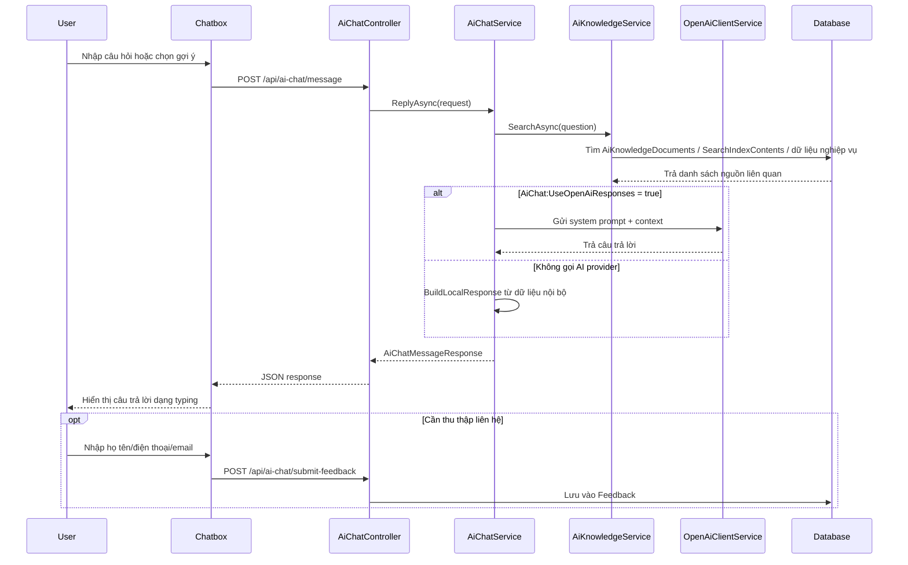

# AI Support / Chatbox - Tóm tắt triển khai

## 1. Mục tiêu AI Support

AI Support / Chatbox là hộp chat hỗ trợ người dùng trên website Sàn giao dịch Công nghệ Thành phố Cần Thơ. Tính năng giúp khách truy cập nhanh chóng tìm thông tin về công nghệ, sản phẩm CNTB, nhà cung ứng, chuyên gia tư vấn, nội dung đã công bố trên website và gửi yêu cầu tư vấn khi cần hỗ trợ thêm.

Mục tiêu chính:

- Giảm thời gian người dùng tìm kiếm thông tin trên website.
- Hỗ trợ tư vấn ban đầu cho doanh nghiệp, nhà cung ứng, chuyên gia và khách truy cập.
- Thu thập lead/yêu cầu liên hệ thông qua form trong chatbox.
- Tận dụng dữ liệu nội bộ đã đồng bộ vào database để trả lời nhanh và ổn định.

## 2. Kiến trúc tổng quan

Tính năng được triển khai theo các lớp sau:

- Frontend chatbox: hiển thị chatbox nổi trong layout chung, xử lý mở/đóng, gửi câu hỏi, hiển thị gợi ý, hiệu ứng typing/typewriter và form liên hệ.
- Backend API: cung cấp endpoint lấy gợi ý, xử lý tin nhắn và lưu thông tin liên hệ.
- Service xử lý chat/knowledge/feedback: điều phối câu trả lời, tìm dữ liệu nội bộ, gọi AI provider nếu được bật và lưu lead.
- Database knowledge base: lưu dữ liệu đã đồng bộ trong `AiKnowledgeDocuments`, ghi nhận job đồng bộ trong `AiKnowledgeSyncJobs`, đồng thời dùng các bảng nội dung hiện có để fallback tìm kiếm.
- AI provider: tích hợp OpenAI Responses API qua `OpenAiClientService`, chỉ được gọi khi cấu hình `AiChat:UseOpenAiResponses` bật.

## 3. Luồng xử lý chính

Người dùng mở website -> Chatbox hiển thị -> Người dùng nhập câu hỏi hoặc chọn gợi ý -> Frontend gọi API -> Backend gọi service xử lý -> Tìm dữ liệu nội bộ -> Gọi AI provider nếu bật -> Trả câu trả lời -> Hiển thị trên chatbox -> Nếu cần thì thu thập thông tin liên hệ.

## 4. Các thành phần đã triển khai

### Giao diện chatbox

- `TechExchangeApp/Views/Shared/_Layout.cshtml`
  - Nạp `~/css/ai-chatbox.css`.
  - Tạo meta anti-forgery token `__RequestVerificationToken`.
  - Render `@await Component.InvokeAsync("AiChatBox")`.
  - Nạp `~/js/ai-chatbox.js`.
- `TechExchangeApp/ViewComponents/AiChatBoxViewComponent.cs`
  - Đọc `AiChatOptions`.
  - Render chatbox khi `AiChat:IsEnabled` bật.
- `TechExchangeApp/Views/Shared/Components/AiChatBox/Default.cshtml`
  - Hiển thị launcher, panel chat, lời chào, vùng tin nhắn, vùng gợi ý, form liên hệ và form nhập câu hỏi.
- `TechExchangeApp/wwwroot/css/ai-chatbox.css`
  - Style chatbox nổi, popup, message bubble, gợi ý nhanh, form liên hệ và responsive mobile.
- `TechExchangeApp/wwwroot/js/ai-chatbox.js`
  - Gửi request đến API.
  - Lưu `sessionKey` bằng `localStorage`.
  - Gửi header `RequestVerificationToken`.
  - Hiển thị phản hồi bot theo hiệu ứng typing/typewriter.
  - Mở form feedback khi backend trả `needsContactInfo = true`.

### API backend

- `TechExchangeApp/Controllers/Api/AiChatController.cs`
  - `GET /api/ai-chat/suggestions`: trả danh sách gợi ý từ `IAiChatService.GetSuggestions()`.
  - `POST /api/ai-chat/message`: validate model, gọi `IAiChatService.ReplyAsync()`, trả `AiChatMessageResponse`.
  - `POST /api/ai-chat/submit-feedback`: yêu cầu có phone hoặc email, gọi `IAiFeedbackService.SaveAsync()`, trả `AiChatFeedbackResponse`.
  - Hai endpoint POST có `[ValidateAntiForgeryToken]`.

### Service nghiệp vụ

- `TechExchangeApp/Services/AiChatService.cs`
  - Quản lý `sessionKey`.
  - Kiểm tra `AiChat:IsEnabled`.
  - Trả lời nhanh cho các intent cơ bản như chào hỏi, cảm ơn, liên hệ.
  - Gọi `AiKnowledgeService` để tìm dữ liệu website.
  - Gọi OpenAI khi `AiChat:UseOpenAiResponses = true`.
  - Fallback bằng câu trả lời local khi không gọi AI hoặc AI không trả kết quả.
- `TechExchangeApp/Services/AiKnowledgeService.cs`
  - Tìm kiếm trong `AiKnowledgeDocuments`.
  - Fallback sang `SearchIndexContents`.
  - Fallback tiếp sang `SanPhamCNTB`, `NhaCungUng`, `NhaTuVan`.
  - Dùng collation `Vietnamese_CI_AI`, bỏ dấu tiếng Việt, làm sạch HTML và giới hạn độ dài summary.
  - Có try/catch riêng từng nguồn dữ liệu để một nguồn lỗi không làm hỏng toàn bộ chat.
- `TechExchangeApp/Services/AiFeedbackService.cs`
  - Lưu thông tin liên hệ vào bảng `Feedback`.
  - Gán `Creator = "AIChat"`.
  - Ghi `SessionKey` và nội dung câu hỏi cuối vào `Content` nếu có.
- `TechExchangeApp/Services/OpenAiClientService.cs`
  - Gọi OpenAI Responses API tại `/v1/responses`.
  - Đọc API key từ `OpenAI:ApiKey`.
  - Dùng model từ `AiChat:ModelName`.
  - Có timeout theo `AiChat:TimeoutSeconds`.
  - Log warning/error và trả `null` khi thiếu key, lỗi HTTP, lỗi parse hoặc exception.

### DTO, config và DI

- `TechExchangeApp/Models/AiChatDtos.cs`
  - `AiChatMessageRequest`
  - `AiChatMessageResponse`
  - `AiChatFeedbackRequest`
  - `AiChatFeedbackResponse`
  - `AiKnowledgeItem`
- `TechExchangeApp/Configuration/AiChatOptions.cs`
  - Mapping section `AiChat`.
  - Chứa các tùy chọn bật/tắt, prompt, model, số context item, timeout và giới hạn message.
- `TechExchangeApp/Program.cs`
  - Đăng ký `AiChatOptions`.
  - Đăng ký `IAiChatService`, `IAiKnowledgeService`, `IAiFeedbackService`.
  - Đăng ký typed `HttpClient` cho `IOpenAiClientService`.

### Database

- Entity thực tế:
  - `TechExchangeApp/Entities/AiKnowledgeDocument.cs` -> bảng `AiKnowledgeDocuments`.
  - `TechExchangeApp/Entities/Feedback.cs` -> bảng `Feedback`.
  - `TechExchangeApp/Domain/Entities/SanPhamEmbedding.cs` -> bảng embedding sản phẩm, thuộc phần AI/search rộng hơn.
  - `TechExchangeApp/Domain/Entities/AISearchLog.cs` -> bảng log AI/search rộng hơn.
- DbSet liên quan trong `TechExchangeApp/Data/AppDbContext.cs`:
  - `AiKnowledgeDocuments`
  - `Feedbacks`
  - `SearchIndexContents`
  - `SanPhamCNTBs`
  - `NhaCungUngs`
  - `NhaTuVans`
  - `SanPhamEmbeddings`
  - `AISearchLogs`
- Bảng được tạo bởi `TechExchangeApp/Create_AiChatSupport_Tables.sql`:
  - `AiChatSettings`
  - `AiChatSessions`
  - `AiChatMessages`
  - `AiKnowledgeDocuments`
  - `AiKnowledgeSyncJobs`
- Lưu ý hiện trạng: source hiện tại chỉ có entity/DbSet trực tiếp cho `AiKnowledgeDocuments` và `Feedback`. Các bảng `AiChatSettings`, `AiChatSessions`, `AiChatMessages`, `AiKnowledgeSyncJobs` được tạo bằng SQL script nhưng chưa có entity/service lưu lịch sử chat tương ứng trong code hiện tại.

### Đồng bộ dữ liệu

- `TechExchangeApp/Create_AiChatSupport_Tables.sql`
  - Tạo các bảng hỗ trợ AI chat và knowledge base nếu chưa tồn tại.
- `TechExchangeApp/Sync_AiKnowledgeDocuments.sql`
  - Đồng bộ dữ liệu vào `AiKnowledgeDocuments`.
  - Ghi trạng thái job vào `AiKnowledgeSyncJobs`.
  - Nguồn đồng bộ thực tế gồm `Contents`, `SanPhamCNTB`, `NhaCungUng`, `NhaTuVan`.
  - Không đồng bộ dữ liệu feedback/lead.

### Feedback/lead

- Form liên hệ nằm trong `TechExchangeApp/Views/Shared/Components/AiChatBox/Default.cshtml`.
- JS gửi dữ liệu đến `POST /api/ai-chat/submit-feedback`.
- Backend validate tối thiểu: bắt buộc có `Phone` hoặc `Email`.
- Service lưu vào bảng `Feedback` với nguồn `AIChat`.

## 5. Cấu hình cần chú ý

Các config key thực tế tìm thấy:

- `AiChat:IsEnabled`: bật/tắt chatbox và xử lý chat.
- `AiChat:BotName`: tên hiển thị của chatbox.
- `AiChat:WelcomeMessage`: lời chào đầu tiên trên UI.
- `AiChat:SystemPrompt`: system instruction gửi cho AI provider khi bật OpenAI.
- `AiChat:ModelName`: model dùng khi gọi OpenAI Responses API.
- `AiChat:UseOpenAiResponses`: bật/tắt gọi OpenAI cho câu trả lời.
- `AiChat:MaxContextItems`: số lượng nguồn dữ liệu nội bộ tối đa đưa vào context/tìm kiếm.
- `AiChat:MaxMessagesPerSession`: giới hạn cấu hình hiện có, chưa thấy code hiện tại dùng để chặn số message.
- `AiChat:TimeoutSeconds`: timeout khi gọi AI provider.
- `OpenAI:ApiKey`: API key OpenAI, chỉ ghi tên key, không ghi giá trị.
- `OpenAI:EmbeddingModel`: model embedding dùng cho phần embedding/search rộng hơn.
- `OpenAI:ChatModel`: model chat mặc định trong cấu hình OpenAI.

Lưu ý: nội dung ban đầu có nhắc `AiChat:MaxKnowledgeItems`, nhưng source hiện tại dùng `AiChat:MaxContextItems`.

## 6. Rủi ro/bảo mật

- API key/connection string: tài liệu này không ghi giá trị thật. Source hiện có các key cấu hình như `OpenAI:ApiKey` và connection string trong `appsettings.json`; khi vận hành cần đưa secret sang biến môi trường hoặc secret store và tránh commit giá trị thật.
- Frontend có lộ secret không: frontend chỉ đọc anti-forgery token từ meta tag và không chứa API key OpenAI.
- Validate request: `AiChatMessageRequest.Message` có `[Required]`, `[MaxLength(2000)]`; các field feedback có `[MaxLength]`. Endpoint submit feedback kiểm tra bắt buộc có phone hoặc email.
- Anti-forgery/rate limit: hai endpoint POST có `[ValidateAntiForgeryToken]`; chưa thấy cơ chế rate limit riêng cho AI chat trong source hiện tại.
- Dữ liệu cá nhân: form liên hệ thu thập họ tên, điện thoại, email và lưu vào `Feedback`; cần xử lý theo quy định bảo vệ dữ liệu cá nhân khi vận hành.
- Dữ liệu gửi sang AI provider: khi `UseOpenAiResponses = true`, backend gửi câu hỏi người dùng, system prompt và context lấy từ dữ liệu website sang OpenAI; cần tránh đưa dữ liệu nhạy cảm không cần thiết vào knowledge base/context.
- Timeout/error handling: `OpenAiClientService` có timeout theo `AiChat:TimeoutSeconds`, log lỗi và fallback trả `null`; `AiChatService` sẽ tự build câu trả lời local nếu AI không trả kết quả.
- Lưu lịch sử chat: các bảng session/message có trong script, nhưng code hiện tại chưa lưu transcript vào `AiChatSessions`/`AiChatMessages`.

## 7. Việc cần làm tiếp theo

- Lưu lịch sử hội thoại nếu cần phân tích chất lượng hỗ trợ.
- Xây dựng dashboard quản trị feedback/log chat.
- Cải thiện tìm kiếm bằng embedding/vector search cho các câu hỏi tự nhiên hơn.
- Tối ưu truy vấn knowledge base khi dữ liệu tăng lớn.
- Bổ sung rate limit cho các endpoint AI chat.
- Theo dõi lỗi API provider, thời gian phản hồi và tỷ lệ fallback.
- Đồng bộ dữ liệu định kỳ vào `AiKnowledgeDocuments`.
- Xây dựng bộ test cho các nhóm câu hỏi phổ biến.

## 8. Đối chiếu với source code

### File source liên quan đã phát hiện

- `TechExchangeApp/Views/Shared/_Layout.cshtml`
- `TechExchangeApp/ViewComponents/AiChatBoxViewComponent.cs`
- `TechExchangeApp/Views/Shared/Components/AiChatBox/Default.cshtml`
- `TechExchangeApp/wwwroot/css/ai-chatbox.css`
- `TechExchangeApp/wwwroot/js/ai-chatbox.js`
- `TechExchangeApp/Controllers/Api/AiChatController.cs`
- `TechExchangeApp/Services/AiChatService.cs`
- `TechExchangeApp/Services/AiKnowledgeService.cs`
- `TechExchangeApp/Services/AiFeedbackService.cs`
- `TechExchangeApp/Services/OpenAiClientService.cs`
- `TechExchangeApp/Models/AiChatDtos.cs`
- `TechExchangeApp/Configuration/AiChatOptions.cs`
- `TechExchangeApp/Entities/AiKnowledgeDocument.cs`
- `TechExchangeApp/Entities/Feedback.cs`
- `TechExchangeApp/Data/AppDbContext.cs`
- `TechExchangeApp/Program.cs`
- `TechExchangeApp/appsettings.json`
- `TechExchangeApp/Create_AiChatSupport_Tables.sql`
- `TechExchangeApp/Sync_AiKnowledgeDocuments.sql`
- `TechExchangeApp/Infrastructure/AI/OpenAIEmbeddingService.cs`
- `TechExchangeApp/Domain/Entities/SanPhamEmbedding.cs`
- `TechExchangeApp/Domain/Entities/AISearchLog.cs`

### Endpoint thực tế

- `GET /api/ai-chat/suggestions`
- `POST /api/ai-chat/message`
- `POST /api/ai-chat/submit-feedback`

### Bảng/entity thực tế

- Entity/DbSet dùng trực tiếp bởi AI chat:
  - `AiKnowledgeDocument` / `AiKnowledgeDocuments`
  - `Feedback` / `Feedbacks`
- Bảng script AI Support tạo thêm:
  - `AiChatSettings`
  - `AiChatSessions`
  - `AiChatMessages`
  - `AiKnowledgeDocuments`
  - `AiKnowledgeSyncJobs`
- Bảng/DbSet được dùng làm nguồn tìm kiếm:
  - `SearchIndexContents`
  - `SanPhamCNTB`
  - `NhaCungUng`
  - `NhaTuVan`
- Thành phần AI/search liên quan trong dự án nhưng không phải luồng chatbox chính:
  - `SanPhamEmbedding` / `SanPhamEmbeddings`
  - `AISearchLog` / `AISearchLogs`

### Điểm nội dung ban đầu chưa khớp source

- `AiChat:MaxKnowledgeItems` không tồn tại trong source hiện tại; key thực tế là `AiChat:MaxContextItems`.
- Có bảng `AiChatSessions` và `AiChatMessages` trong script, nhưng code hiện tại chưa lưu lịch sử hội thoại vào các bảng này.
- Có `OpenAI:EmbeddingModel` và `OpenAIEmbeddingService` trong dự án, nhưng luồng Chatbox hiện tại chưa dùng embedding/vector search trực tiếp.
- Chưa thấy rate limit riêng cho endpoint AI chat trong source hiện tại.
